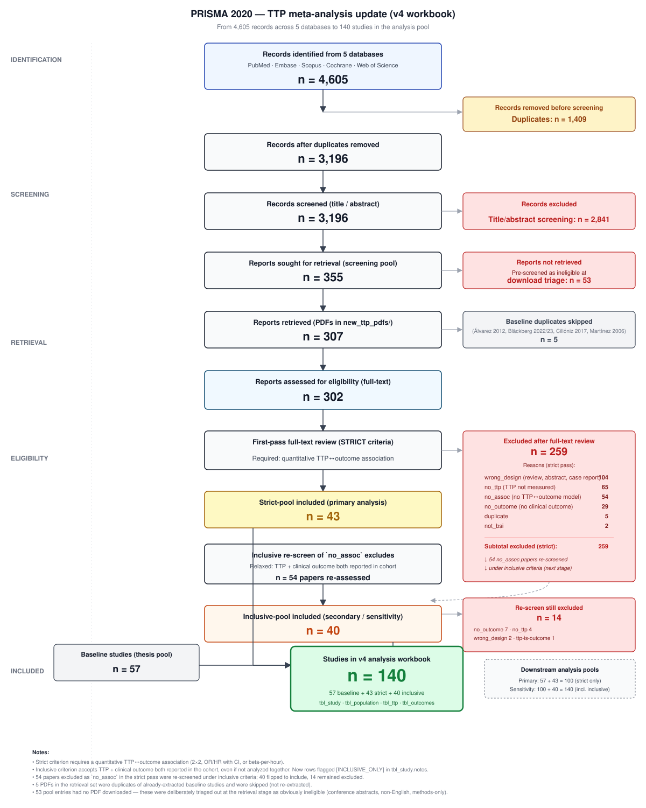

```{r setup}
#| include: false
suppressPackageStartupMessages({
  library(tidyverse)
  library(brms)
  library(metafor)
  library(posterior)
  library(bayesplot)
  library(ggdist)
  library(patchwork)
  library(knitr)
  library(gt)
})

source("R/01_prepare_data.R")
source("R/02_fit_models.R")

# -------- PRIMARY POOL: strict (n=100) ---------------------------------------
es_all   <- prepare_effect_sizes("data/TTP_MetaAnalysis_Extraction_Complete_v4.xlsx",
                                 include_inclusive_pool = FALSE,
                                 drop_contaminated_ttp  = TRUE)
es_mort  <- es_for_outcome(es_all, "mortality")

# -------- SENSITIVITY POOL: strict + inclusive (n=140) -----------------------
es_all_inc  <- prepare_effect_sizes("data/TTP_MetaAnalysis_Extraction_Complete_v4.xlsx",
                                    include_inclusive_pool = TRUE,
                                    drop_contaminated_ttp  = TRUE)
es_mort_inc <- es_for_outcome(es_all_inc, "mortality")

# -------- FIT MODELS (cached) ------------------------------------------------
fits      <- fit_all_models(es_mort,      cache_dir = "_brms_cache/primary")
fits_inc  <- fit_all_models(es_mort_inc,  cache_dir = "_brms_cache/sensitivity")
```

```{r summaries}
#| include: false
#| cache: false
# Summaries are always recomputed from the cached fits so changes to
# pooled_summary() (e.g. adding pi_OR) take effect without clearing the cache.
source("R/02_fit_models.R")
base_post <- pooled_summary(fits$fit_base)
inc_post  <- pooled_summary(fits_inc$fit_base)
```

# Executive summary {.unnumbered}

```{r exec-summary}
#| results: asis
n_studies   <- attr(es_all, "n_studies")
n_es        <- nrow(es_mort)
n_studies_i <- attr(es_all_inc, "n_studies")
n_es_i      <- nrow(es_mort_inc)
cat(sprintf("**Primary analysis** (strict pool): %d studies contributing %d mortality effect sizes.  \n", n_studies, n_es))
cat(sprintf("**Sensitivity analysis** (strict + inclusive pool): %d studies, %d effect sizes.  \n", n_studies_i, n_es_i))
```

::: {.callout-important}
## Primary result (strict pool)

**Pooled odds ratio for mortality (short vs long TTP):**

```{r exec-or}
#| results: asis
cat(sprintf("- **OR = %.2f** (95%% CrI: %.2f–%.2f)  \n",
            base_post$median_OR, base_post$ci_OR[1], base_post$ci_OR[2]))
cat(sprintf("- 95%% prediction interval (new study): **%.2f–%.2f**  \n",
            base_post$pi_OR[1], base_post$pi_OR[2]))
cat(sprintf("- Probability that shorter TTP increases mortality: **%.1f%%**  \n", base_post$p_harm * 100))
cat(sprintf("- Between-study heterogeneity: I² = %.0f%%, τ = %.2f  \n", base_post$median_i2, base_post$median_tau))
```
:::

::: {.callout-tip}
## Sensitivity result (n=140)

```{r exec-or-sens}
#| results: asis
cat(sprintf("Including the 40 inclusive-pool studies: **OR = %.2f** (95%% CrI: %.2f–%.2f), P(harm) = %.1f%%, I² = %.0f%%.  \n",
            inc_post$median_OR, inc_post$ci_OR[1], inc_post$ci_OR[2],
            inc_post$p_harm * 100, inc_post$median_i2))
```
:::

# Background

Bloodstream infections are associated with significant morbidity and mortality. Time-to-positivity (TTP) — the interval between blood culture incubation start and detection of bacterial growth — has been proposed as a prognostic marker. Faster growth (shorter TTP) reflects higher bacterial burden or pathogen virulence, hypothesised to predict worse clinical outcomes.

This is the v4 update of a previously-published meta-analysis that included 57 studies (Feb 2026). The database has been expanded with 43 newly-extracted studies meeting the original strict eligibility criterion (quantitative TTP↔outcome association), yielding the n=100 primary pool. An additional 40 studies meeting an inclusive criterion (TTP + outcome both reported in the cohort, even without a formal model) form the n=140 sensitivity pool.

# Methods

## Data source

The analysis dataset is `data/TTP_MetaAnalysis_Extraction_Complete_v4.xlsx`. Effect sizes (log odds ratios) were computed using `metafor::escalc()`:

- **2×2 tables** when events/totals by TTP category are reported (preferred when available)
- **Back-calculated** from reported OR/HR/RR with 95% CI when 2×2 unavailable
- **Per-hour estimates** (continuous TTP) reported separately

The full effect-size pipeline is in `R/01_prepare_data.R`.

## Bayesian random-effects meta-analysis

Primary model (specified in `R/02_fit_models.R`):

$$y_i \mid \text{SE}_i \sim \mathcal{N}\!\left(\mu + u_s,\,\text{SE}_i^2\right),\quad u_s \sim \mathcal{N}(0,\tau^2)$$

with weakly-informative priors $\mu \sim \mathcal{N}(0,1)$, $\tau \sim \text{Half-Cauchy}(0,0.5)$, moderator coefficients $\mathcal{N}(0,0.5)$. Fitted with `brms` 4×4000 iterations (1000 warm-up), `adapt_delta = 0.99`, `max_treedepth = 12`.

## PRISMA flow

{#fig-prisma width="100%"}

# Primary results — mortality

## Overall pooled effect

```{r}
#| label: tbl-overall
#| tbl-cap: "Pooled effect of short vs long TTP on mortality (OR > 1 = short TTP harmful). Primary pool only (strict criterion)."
tibble(
  Parameter = c("Median OR (short vs long TTP)",
                "95% credible interval",
                "95% prediction interval (new study)",
                "P(short TTP harmful)",
                "Between-study SD (τ)",
                "Heterogeneity (I²)"),
  Value = c(
    sprintf("%.2f", base_post$median_OR),
    sprintf("[%.2f, %.2f]", base_post$ci_OR[1], base_post$ci_OR[2]),
    sprintf("[%.2f, %.2f]", base_post$pi_OR[1], base_post$pi_OR[2]),
    sprintf("%.1f%%", base_post$p_harm * 100),
    sprintf("%.2f", base_post$median_tau),
    sprintf("%.0f%%", base_post$median_i2)
  )
) |> gt() |>
  tab_style(style = cell_text(weight = "bold"),
            locations = cells_body(rows = 1)) |>
  tab_style(style = cell_text(style = "italic", color = "gray40"),
            locations = cells_body(rows = 3))
```

## Forest plot

```{r}
#| label: fig-forest
#| fig-cap: "Forest plot of OR (short vs long TTP) on mortality — primary pool. Each row is a single effect size; multi-arm studies appear multiple times. Pooled estimate from the Bayesian model in red."

fig_h <- max(6, nrow(es_mort) * 0.30 + 2)
knitr::opts_current$set(fig.height = fig_h)

forest_data <- es_mort |>
  arrange(yi) |>
  mutate(
    lbl = paste0(study_id,
                 ifelse(arm_id == "all", "", paste0(" [", arm_id, "]"))),
    lbl = make.unique(lbl, sep = " #"),
    lbl = factor(lbl, levels = lbl),
    or = exp(yi),
    ci_low  = exp(yi - 1.96*sei),
    ci_high = exp(yi + 1.96*sei),
    type = "Study"
  )

pooled_row <- tibble(
  lbl = "POOLED (Bayesian)",
  or = base_post$median_OR,
  ci_low  = base_post$ci_OR[1],
  ci_high = base_post$ci_OR[2],
  type = "Pooled"
)
pi_row <- tibble(
  lbl     = "POOLED (Bayesian)",
  pi_low  = base_post$pi_OR[1],
  pi_high = base_post$pi_OR[2]
)

forest_data$lbl <- factor(forest_data$lbl,
                          levels = c("POOLED (Bayesian)", levels(forest_data$lbl)))
pooled_row$lbl <- factor(pooled_row$lbl, levels = levels(forest_data$lbl))
pi_row$lbl     <- factor(pi_row$lbl,     levels = levels(forest_data$lbl))

ggplot(bind_rows(forest_data, pooled_row),
       aes(x = or, y = lbl, color = type)) +
  geom_vline(xintercept = 1, linetype = "dashed", color = "gray50") +
  geom_point(size = 2.5) +
  geom_errorbar(aes(xmin = pmax(ci_low, 0.05),
                    xmax = pmin(ci_high, 50)),
                width = 0.25, linewidth = 0.7, orientation = "y") +
  # 95% prediction interval — wider dashed bar on pooled row only
  geom_errorbar(data = pi_row,
                aes(y = lbl,
                    xmin = pmax(pi_low,  0.05),
                    xmax = pmin(pi_high, 50)),
                width = 0.15, linewidth = 0.7, linetype = "dashed",
                color = "darkred", inherit.aes = FALSE) +
  scale_color_manual(values = c("Study" = "steelblue", "Pooled" = "darkred")) +
  scale_x_log10(breaks = c(0.1, 0.25, 0.5, 1, 2, 4, 8, 16, 32),
                limits = c(0.05, 50)) +
  labs(title = "Mortality forest plot — primary pool",
       subtitle = "Red solid bar = 95% CrI of pooled OR; red dashed bar = 95% prediction interval",
       x = "OR, short vs long TTP (log scale)",
       y = NULL, color = NULL) +
  theme_minimal(base_size = 9) +
  theme(legend.position = "bottom",
        axis.text.y = element_text(size = 7, lineheight = 0.85),
        panel.grid.major.y = element_line(color = "gray92"),
        panel.grid.minor = element_blank())
```

## Posterior density of pooled OR

```{r}
#| label: fig-posterior
#| fig-cap: "Posterior density of the pooled OR (short vs long TTP). The vertical red line marks no effect (OR = 1)."
post_df <- tibble(OR = base_post$OR_draws)
ggplot(post_df, aes(x = OR)) +
  stat_halfeye(fill = "#1f78b4", alpha = 0.6) +
  geom_vline(xintercept = 1, linetype = "dashed", color = "red") +
  scale_x_continuous(limits = c(0.5, 6), breaks = seq(0.5, 6, 0.5)) +
  labs(x = "Pooled OR (short vs long TTP)", y = "Posterior density") +
  theme_minimal()
```

## Diagnostics

```{r}
#| label: tbl-diag
#| tbl-cap: "Convergence diagnostics for the primary pooled model."
posterior::summarise_draws(
  as_draws_df(fits$fit_base),
  rhat = posterior::rhat,
  ess_bulk = posterior::ess_bulk
) |>
  filter(!grepl("^lp__|^lprior", variable)) |>
  transmute(
    Parameter = variable,
    `R̂` = sprintf("%.3f", rhat),
    ESS_bulk = sprintf("%.0f", ess_bulk)
  ) |>
  gt()
```

```{r}
#| label: fig-trace
#| fig-cap: "Trace plots for key parameters of the primary pooled model. Well-mixed chains (caterpillar appearance) indicate good convergence."
#| fig-height: 6
bayesplot::mcmc_trace(
  fits$fit_base,
  pars = c("b_Intercept", "sd_study_id__Intercept"),
  facet_args = list(labeller = as_labeller(c(
    b_Intercept              = "μ (pooled log-OR)",
    sd_study_id__Intercept   = "τ (between-study SD)"
  )))
) +
  theme_minimal(base_size = 11)
```

```{r}
#| label: fig-rank
#| fig-cap: "Rank histograms for key parameters. Uniform bars across all chains indicate no chain-mixing issues."
#| fig-height: 4
bayesplot::mcmc_rank_overlay(
  fits$fit_base,
  pars = c("b_Intercept", "sd_study_id__Intercept")
) +
  theme_minimal(base_size = 11)
```

```{r}
#| label: fig-rhat
#| fig-cap: "R̂ dot plot for all parameters of the primary pooled model. All values should fall below 1.01 (dashed line)."
#| fig-height: 5
rhat_vals <- posterior::summarise_draws(fits$fit_base, rhat = posterior::rhat) |>
  filter(!grepl("^lp__|^lprior", variable)) |>
  (\(d) setNames(d$rhat, d$variable))()

bayesplot::mcmc_rhat(rhat_vals) +
  geom_vline(xintercept = 1.01, linetype = "dashed", color = "red") +
  theme_minimal(base_size = 11)
```

# Subgroup analysis — pathogen class

```{r}
#| label: fig-subgroup
#| fig-cap: "Forest plot stratified by pathogen class. Pooled estimates for each subgroup overlaid in bold."

# Only proceed if both subgroups fit
if (!is.null(fits$fit_gram_pos) && !is.null(fits$fit_gram_neg)) {
  gpos_post <- pooled_summary(fits$fit_gram_pos)
  gneg_post <- pooled_summary(fits$fit_gram_neg)

  sub_df <- es_mort |>
    filter(pathogen_class %in% c("gram_positive", "gram_negative")) |>
    mutate(or = exp(yi),
           ci_low = exp(yi - 1.96*sei),
           ci_high = exp(yi + 1.96*sei),
           type = "Study")

  pooled_sub <- tibble(
    study_id = c("POOLED gram-positive", "POOLED gram-negative"),
    pathogen_class = c("gram_positive", "gram_negative"),
    or = c(gpos_post$median_OR, gneg_post$median_OR),
    ci_low = c(gpos_post$ci_OR[1], gneg_post$ci_OR[1]),
    ci_high = c(gpos_post$ci_OR[2], gneg_post$ci_OR[2]),
    type = "Pooled"
  )

  ggplot(bind_rows(sub_df, pooled_sub),
         aes(x = or, y = reorder(study_id, or), color = pathogen_class, shape = type, size = type)) +
    geom_vline(xintercept = 1, linetype = "dashed", color = "gray50") +
    geom_point() +
    geom_errorbar(aes(xmin = pmax(ci_low, 0.05), xmax = pmin(ci_high, 50)),
                  width = 0.25, orientation = "y") +
    scale_color_manual(values = c("gram_positive" = "#377EB8", "gram_negative" = "#E41A1C")) +
    scale_shape_manual(values = c("Study" = 16, "Pooled" = 18), guide = "none") +
    scale_size_manual(values = c("Study" = 2.5, "Pooled" = 5), guide = "none") +
    scale_x_log10(breaks = c(0.1, 0.5, 1, 2, 5, 10, 20), limits = c(0.05, 50)) +
    labs(x = "OR, short vs long TTP (log scale)", y = NULL, color = "Pathogen class") +
    theme_minimal(base_size = 9) +
    theme(legend.position = "bottom")
}
```

```{r}
#| label: tbl-subgroup
#| tbl-cap: "Pooled OR by pathogen subgroup."
if (!is.null(fits$fit_gram_pos) && !is.null(fits$fit_gram_neg)) {
  gpos_post <- pooled_summary(fits$fit_gram_pos)
  gneg_post <- pooled_summary(fits$fit_gram_neg)
  tibble(
    Subgroup = c("Gram-positive", "Gram-negative"),
    `N effect sizes` = c(nrow(filter(es_mort, pathogen_class == "gram_positive")),
                         nrow(filter(es_mort, pathogen_class == "gram_negative"))),
    `Median OR` = sprintf("%.2f", c(gpos_post$median_OR, gneg_post$median_OR)),
    `95% CrI`   = sprintf("[%.2f, %.2f]",
                          c(gpos_post$ci_OR[1], gneg_post$ci_OR[1]),
                          c(gpos_post$ci_OR[2], gneg_post$ci_OR[2])),
    `P(short TTP harmful)` = sprintf("%.1f%%",
                                     c(gpos_post$p_harm, gneg_post$p_harm) * 100)
  ) |> gt()
}
```

# TTP cutpoint dose-response

```{r}
#| label: fig-cutpoint
#| fig-cap: "TTP cutpoint meta-regression. The blue line is the Bayesian posterior median predicted OR by cutpoint; ribbon is the 95% CrI. Red points are observed 2×2-derived effect sizes (size ∝ precision)."

if (!is.null(fits$fit_cutpoint)) {
  draws <- as_draws_df(fits$fit_cutpoint)
  med_cp <- median(es_mort$ttp_cutpoint_hours[es_mort$es_source == "two_by_two"], na.rm = TRUE)
  range_cp <- seq(6, 96, by = 1)
  pred_df <- map_dfr(range_cp, function(cp) {
    centered <- cp - med_cp
    logOR <- draws$b_Intercept + draws$b_cutpoint_c * centered
    tibble(cutpoint = cp,
           median_OR = median(exp(logOR)),
           lo = quantile(exp(logOR), 0.025),
           hi = quantile(exp(logOR), 0.975))
  })

  obs_df <- es_mort |>
    filter(es_source == "two_by_two", !is.na(ttp_cutpoint_hours)) |>
    mutate(or = exp(yi), w = 1/sei)

  slope_p_neg <- mean(draws$b_cutpoint_c < 0) * 100
  slope_med <- median(draws$b_cutpoint_c)

  ggplot(pred_df, aes(x = cutpoint, y = median_OR)) +
    geom_ribbon(aes(ymin = lo, ymax = hi), fill = "steelblue", alpha = 0.2) +
    geom_line(color = "darkblue", linewidth = 1.4) +
    geom_hline(yintercept = 1, linetype = "dashed", color = "red") +
    geom_point(data = obs_df,
               aes(x = ttp_cutpoint_hours, y = or, size = w),
               alpha = 0.55, color = "darkred", inherit.aes = FALSE) +
    scale_size_continuous(range = c(2, 7), guide = "none") +
    scale_y_continuous(limits = c(0, max(5, max(pred_df$hi, na.rm = TRUE))),
                       breaks = seq(0, 10, 0.5)) +
    labs(title = sprintf("TTP cutpoint meta-regression (slope = %.3f log-OR/h, P<0 = %.1f%%)",
                         slope_med, slope_p_neg),
         x = "TTP cutpoint (hours)",
         y = "Predicted OR (short vs long TTP)") +
    theme_minimal()
}
```

# Publication bias

```{r}
#| label: pub-bias-setup
#| include: false
# Fit a frequentist RE model for Egger's test (REML, same data as primary Bayesian model)
rma_mort <- metafor::rma(yi = yi, sei = sei, data = es_mort, method = "REML")
mu_pool  <- as.numeric(coef(rma_mort))
egger    <- metafor::regtest(rma_mort, model = "lm")
```

## Contour-enhanced funnel plot

```{r}
#| label: fig-funnel
#| fig-cap: "Contour-enhanced funnel plot (primary pool, mortality). Studies in white zones are not statistically significant at the labelled threshold; shaded outer zones indicate increasing levels of significance. Asymmetry toward the right (short TTP harmful) would suggest positive-result publication bias."
#| fig-height: 6

max_se  <- max(es_mort$sei, na.rm = TRUE) * 1.08
se_seq  <- seq(0, max_se, length.out = 400)
x_lo    <- mu_pool - 3.1 * max_se
x_hi    <- mu_pool + 3.1 * max_se

contours <- tibble(se = se_seq) |>
  mutate(
    lo01 = mu_pool - 2.576 * se,  hi01 = mu_pool + 2.576 * se,
    lo05 = mu_pool - 1.96  * se,  hi05 = mu_pool + 1.96  * se,
    lo10 = mu_pool - 1.645 * se,  hi10 = mu_pool + 1.645 * se
  )

ggplot() +
  # Shaded significance regions (draw outermost first, then overwrite inward)
  geom_ribbon(data = contours,
              aes(y = se, xmin = x_lo,  xmax = lo01), fill = "gray55") +
  geom_ribbon(data = contours,
              aes(y = se, xmin = hi01,  xmax = x_hi), fill = "gray55") +
  geom_ribbon(data = contours,
              aes(y = se, xmin = lo01,  xmax = lo05), fill = "gray75") +
  geom_ribbon(data = contours,
              aes(y = se, xmin = hi05,  xmax = hi01), fill = "gray75") +
  geom_ribbon(data = contours,
              aes(y = se, xmin = lo05,  xmax = lo10), fill = "gray90") +
  geom_ribbon(data = contours,
              aes(y = se, xmin = hi10,  xmax = hi05), fill = "gray90") +
  geom_ribbon(data = contours,
              aes(y = se, xmin = lo10,  xmax = hi10), fill = "white") +
  # Study points
  geom_point(data = es_mort, aes(x = yi, y = sei),
             shape = 21, fill = "steelblue", color = "white",
             size = 2.2, alpha = 0.75) +
  # Pooled estimate (REML)
  geom_vline(xintercept = mu_pool, linetype = "dashed", color = "darkred", linewidth = 0.8) +
  # Null line
  geom_vline(xintercept = 0, linetype = "dotted", color = "gray30") +
  # Contour labels
  annotate("text", x = x_hi - 0.05, y = max_se * 0.12,
           label = "p < 0.01", hjust = 1, size = 3, color = "gray30") +
  annotate("text", x = x_hi - 0.05, y = max_se * 0.38,
           label = "p < 0.05", hjust = 1, size = 3, color = "gray40") +
  annotate("text", x = x_hi - 0.05, y = max_se * 0.62,
           label = "p < 0.10", hjust = 1, size = 3, color = "gray50") +
  scale_y_reverse(limits = c(max_se, 0),
                  name = "Standard error (SE)") +
  scale_x_continuous(limits = c(x_lo, x_hi),
                     name = "Log OR (short vs long TTP)") +
  theme_minimal(base_size = 11) +
  theme(panel.grid.minor = element_blank())
```

## Egger's test

```{r}
#| label: tbl-egger
#| tbl-cap: "Egger's regression test for funnel-plot asymmetry (primary pool, mortality). The intercept tests whether effect-size magnitude varies with precision in a manner inconsistent with sampling error alone."
tibble(
  Statistic = c("Intercept (bias term)", "95% CI", "t-statistic", "df", "p-value"),
  Value = c(
    sprintf("%.3f",  egger$est),
    sprintf("[%.3f, %.3f]", egger$ci.lb, egger$ci.ub),
    sprintf("%.3f",  egger$zval),
    sprintf("%.0f",  egger$ddf),
    sprintf("%.3f",  egger$pval)
  )
) |> gt()
```

::: {.callout-note}
## Interpreting Egger's test in this context
Egger's test has known limitations when between-study heterogeneity is high (as here): the test can flag asymmetry that reflects genuine heterogeneity rather than publication bias. An intercept materially different from zero should be followed up by examining whether small-study effects correlate with identifiable moderators (e.g., pathogen class, adjustment status) before attributing asymmetry to selective reporting.
:::

# Sensitivity analyses

## Including the inclusive-pool studies (n=140)

```{r}
#| label: fig-sens-inc
#| fig-cap: "Posterior densities of pooled OR — primary pool vs sensitivity pool (with inclusive-only studies added)."
sens_df <- bind_rows(
  tibble(OR = base_post$OR_draws, Pool = sprintf("Primary (n=%d)", attr(es_all, "n_studies"))),
  tibble(OR = inc_post$OR_draws,  Pool = sprintf("Sensitivity (n=%d)", attr(es_all_inc, "n_studies")))
)
ggplot(sens_df, aes(x = OR, fill = Pool)) +
  geom_density(alpha = 0.55) +
  geom_vline(xintercept = 1, linetype = "dashed", color = "red") +
  scale_x_continuous(limits = c(0.5, 5)) +
  scale_fill_brewer(palette = "Set1") +
  labs(x = "OR (short vs long TTP)", y = "Posterior density") +
  theme_minimal() + theme(legend.position = "bottom")
```

## Data source (es_source)

Do pooled ORs differ depending on how the effect size was derived — from a 2×2 table vs a back-calculated reported estimate?

```{r}
#| label: tbl-es-source-counts
#| tbl-cap: "Effect sizes in the primary pool by derivation source."
es_mort |>
  count(es_source) |>
  mutate(
    es_source = recode(es_source,
      two_by_two           = "2×2 table",
      reported_adjusted    = "Reported (adjusted)",
      reported_unadjusted  = "Reported (unadjusted)"
    ),
    pct = sprintf("%.1f%%", 100 * n / sum(n))
  ) |>
  rename(`ES source` = es_source, N = n, `%` = pct) |>
  gt()
```

```{r}
#| label: tbl-es-source-pooled
#| tbl-cap: "Pooled OR by effect-size source. The 2×2 and reported-only estimates come from separate Bayesian RE models; contrasts come from the joint meta-regression (two_by_two as reference)."
if (!is.null(fits$fit_2x2) && !is.null(fits$fit_reported) &&
    !is.null(fits$fit_es_source)) {

  post_2x2 <- pooled_summary(fits$fit_2x2)
  post_rep  <- pooled_summary(fits$fit_reported)

  # Meta-regression draws for each source level
  d_src <- as_draws_df(fits$fit_es_source)
  b_adj   <- d_src[[grep("reported_adjusted",    names(d_src), value = TRUE)[1]]]
  b_unadj <- d_src[[grep("reported_unadjusted",  names(d_src), value = TRUE)[1]]]

  contr <- tibble(
    Source      = c("Reported (adjusted) vs 2×2",
                    "Reported (unadjusted) vs 2×2"),
    `Δ log-OR`  = sprintf("%.3f", c(median(b_adj), median(b_unadj))),
    `95% CrI`   = sprintf("[%.3f, %.3f]",
                           c(quantile(b_adj,   0.025), quantile(b_unadj,   0.025)),
                           c(quantile(b_adj,   0.975), quantile(b_unadj,   0.975))),
    `P(Δ ≠ 0)`  = sprintf("%.1f%%",
                           c(mean(b_adj   > 0), mean(b_unadj > 0)) * 100)
  )

  bind_rows(
    tibble(Source = "2×2 table",
           `Median OR` = sprintf("%.2f", post_2x2$median_OR),
           `95% CrI`   = sprintf("[%.2f, %.2f]", post_2x2$ci_OR[1], post_2x2$ci_OR[2]),
           `N` = sprintf("%d", nrow(filter(es_mort, es_source == "two_by_two")))),
    tibble(Source = "Reported (any)",
           `Median OR` = sprintf("%.2f", post_rep$median_OR),
           `95% CrI`   = sprintf("[%.2f, %.2f]", post_rep$ci_OR[1], post_rep$ci_OR[2]),
           `N` = sprintf("%d", nrow(filter(es_mort, grepl("reported", es_source)))))
  ) |> gt() |>
    tab_style(style = cell_text(weight = "bold"),
              locations = cells_column_labels())
}
```

```{r}
#| label: fig-es-source-density
#| fig-cap: "Posterior densities of pooled OR by effect-size source. Substantial overlap indicates the signal is not driven by one derivation method."
if (!is.null(fits$fit_2x2) && !is.null(fits$fit_reported)) {
  post_2x2 <- pooled_summary(fits$fit_2x2)
  post_rep  <- pooled_summary(fits$fit_reported)

  bind_rows(
    tibble(OR = base_post$OR_draws,   Source = "All sources"),
    tibble(OR = post_2x2$OR_draws,    Source = "2×2 table only"),
    tibble(OR = post_rep$OR_draws,    Source = "Reported only")
  ) |>
    ggplot(aes(x = OR, fill = Source)) +
    geom_density(alpha = 0.45) +
    geom_vline(xintercept = 1, linetype = "dashed", color = "red") +
    scale_x_continuous(limits = c(0.5, 5)) +
    scale_fill_brewer(palette = "Dark2") +
    labs(x = "Pooled OR (short vs long TTP)", y = "Posterior density") +
    theme_minimal() +
    theme(legend.position = "bottom")
}
```

```{r}
#| label: tbl-es-source-contrasts
#| tbl-cap: "Meta-regression contrasts vs the 2×2-derived reference. A positive Δ log-OR indicates the reported-estimate sources show a larger short-TTP harm signal than the 2×2 pool."
if (!is.null(fits$fit_es_source)) {
  d_src   <- as_draws_df(fits$fit_es_source)
  b_adj   <- d_src[[grep("reported_adjusted",   names(d_src), value = TRUE)[1]]]
  b_unadj <- d_src[[grep("reported_unadjusted", names(d_src), value = TRUE)[1]]]

  tibble(
    Contrast    = c("Reported (adjusted) vs 2×2",
                    "Reported (unadjusted) vs 2×2"),
    `Δ log-OR`  = sprintf("%+.3f", c(median(b_adj), median(b_unadj))),
    `95% CrI`   = sprintf("[%+.3f, %+.3f]",
                           c(quantile(b_adj,   0.025), quantile(b_unadj,   0.025)),
                           c(quantile(b_adj,   0.975), quantile(b_unadj,   0.975))),
    `P(Δ > 0)`  = sprintf("%.1f%%",
                           c(mean(b_adj > 0), mean(b_unadj > 0)) * 100)
  ) |> gt()
}
```

## Convergence — sensitivity pool

```{r}
#| label: fig-trace-sens
#| fig-cap: "Trace plots for key parameters of the sensitivity (n=140) model."
#| fig-height: 6
bayesplot::mcmc_trace(
  fits_inc$fit_base,
  pars = c("b_Intercept", "sd_study_id__Intercept"),
  facet_args = list(labeller = as_labeller(c(
    b_Intercept              = "μ (pooled log-OR)",
    sd_study_id__Intercept   = "τ (between-study SD)"
  )))
) +
  theme_minimal(base_size = 11)
```

```{r}
#| label: fig-rank-sens
#| fig-cap: "Rank histograms for key parameters of the sensitivity (n=140) model."
#| fig-height: 4
bayesplot::mcmc_rank_overlay(
  fits_inc$fit_base,
  pars = c("b_Intercept", "sd_study_id__Intercept")
) +
  theme_minimal(base_size = 11)
```

```{r}
#| label: fig-rhat-sens
#| fig-cap: "R̂ dot plot for all parameters of the sensitivity (n=140) model. All values should fall below 1.01 (dashed line)."
#| fig-height: 5
rhat_vals_sens <- posterior::summarise_draws(fits_inc$fit_base, rhat = posterior::rhat) |>
  filter(!grepl("^lp__|^lprior", variable)) |>
  (\(d) setNames(d$rhat, d$variable))()

bayesplot::mcmc_rhat(rhat_vals_sens) +
  geom_vline(xintercept = 1.01, linetype = "dashed", color = "red") +
  theme_minimal(base_size = 11)
```

## Other moderators

```{r}
#| label: tbl-mods
#| tbl-cap: "All moderator and sensitivity analyses (primary pool). Δ log-OR is the change in pooled log-OR per unit of the moderator; negative values shrink the short-TTP harm signal."
mod_row <- function(fit, name, scale = 1, p_dir = "<") {
  if (is.null(fit)) return(tibble(Moderator = name, `Δ log-OR` = "—", `95% CrI` = "—", `P(direction)` = "—"))
  d <- as_draws_df(fit)
  b <- d[[grep("^b_(?!Intercept)", names(d), perl = TRUE)[1]]]
  if (is.null(b)) return(tibble(Moderator = name, `Δ log-OR` = "—", `95% CrI` = "—", `P(direction)` = "—"))
  pdir <- if (p_dir == "<") mean(b < 0) else mean(b > 0)
  tibble(
    Moderator = name,
    `Δ log-OR` = sprintf("%.3f", median(b) * scale),
    `95% CrI`  = sprintf("[%.3f, %.3f]",
                         quantile(b, 0.025) * scale,
                         quantile(b, 0.975) * scale),
    `P(direction)` = sprintf("%.1f%%", pdir * 100)
  )
}

bind_rows(
  mod_row(fits$fit_cutpoint,   "TTP cutpoint (per 10 h)", scale = 10),
  mod_row(fits$fit_metareg,    "Pathogen: Gram+ vs Gram−"),
  mod_row(fits$fit_adjustment, "Adjustment: adjusted vs unadjusted", p_dir = ">"),
  mod_row(fits$fit_year,       "Publication year (per 5 yr)",       scale = 5)
) |> gt()
```

# Data quality / risk of bias

See the **Risk of bias** page for the traffic-light QUIPS plot. Quick summary:

```{r rob-summary}
rob_summary <- attr(es_all, "tbl_study") |>
  count(rob_overall) |>
  mutate(`%` = sprintf("%.1f%%", 100 * n / sum(n))) |>
  arrange(factor(rob_overall, levels = c("low", "moderate", "high", "critical")))
rob_summary |> gt()
```

# Reproducibility

All analyses are reproducible from this Quarto project:

1. `git clone` the repo
2. Open `ttp-meta-v4.Rproj` in RStudio (or `cd` in)
3. `renv::restore()` (or install packages listed in `R/01_prepare_data.R` + `R/02_fit_models.R`)
4. `quarto render` — first build will compile Stan models (~10–20 min); subsequent builds use the cached `_brms_cache/`

```{r session-info}
#| code-fold: true
sessionInfo()
```
